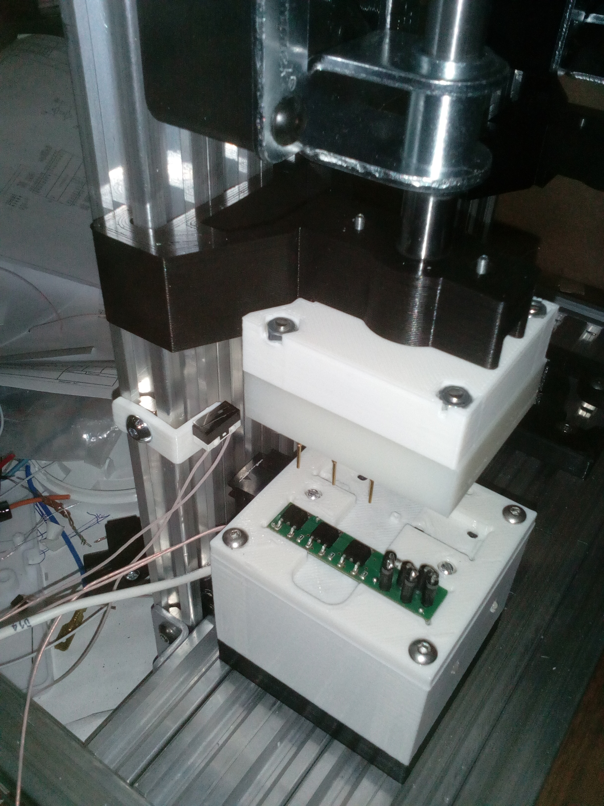
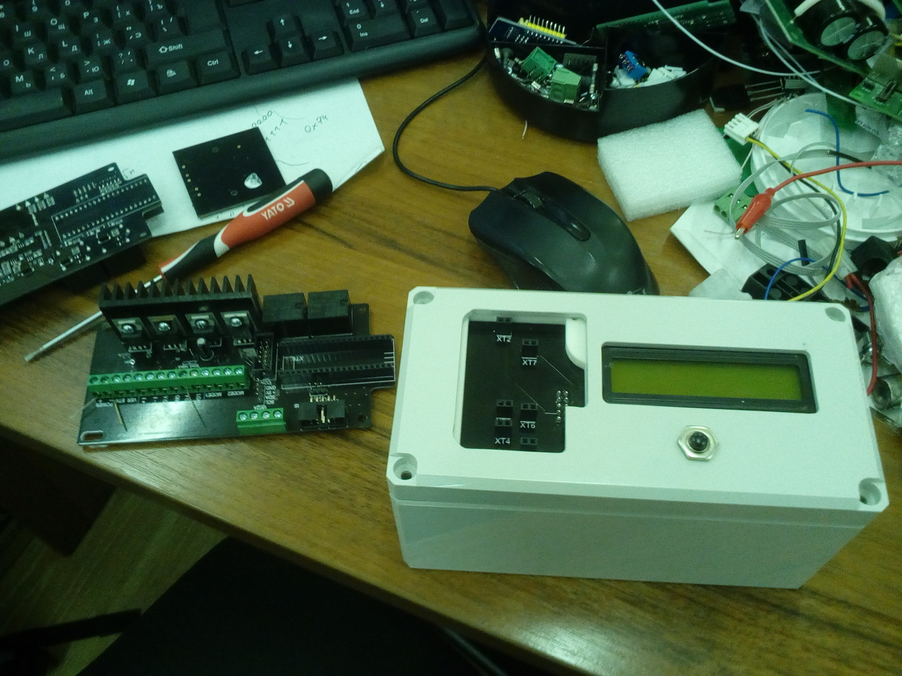
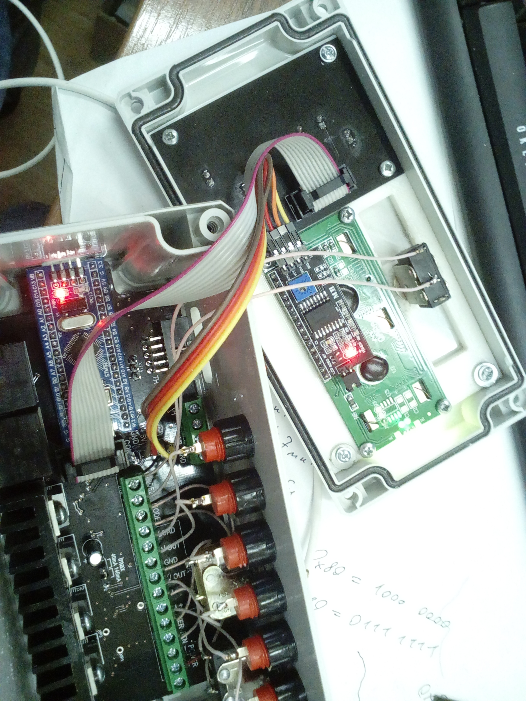

# PCB Test Bench for Explosion Protection Modules

This project is a **test setup for PCBs used in explosion protection devices**.  
It automatically tests the electrical behavior of the boards in different modes to verify proper thyristor and zener diode operation.  
The setup runs on an **STM32F103 microcontroller** and controls adjustable voltage, current, and digital resistors to perform precise measurements.

---

## 📷 Hardware Setup

Two testing modes are supported:
- **Open PCB mode** — board tested via needles, each thyristor checked separately.
- **Coated PCB mode** — board with protective coating, all thyristors tested together.

The system includes:
- Adjustable **voltage and current sources**
- Measurement circuits for **high/low current ranges**
- **Display** for status messages and results
- **Control buttons** for operator input (Start, Mode, Tamper)
- **Digital resistors** for voltage and load adjustment

---

### Example Setup Photos
 
  
  

